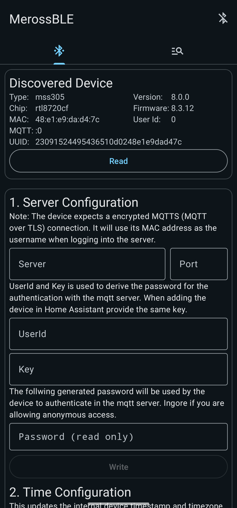
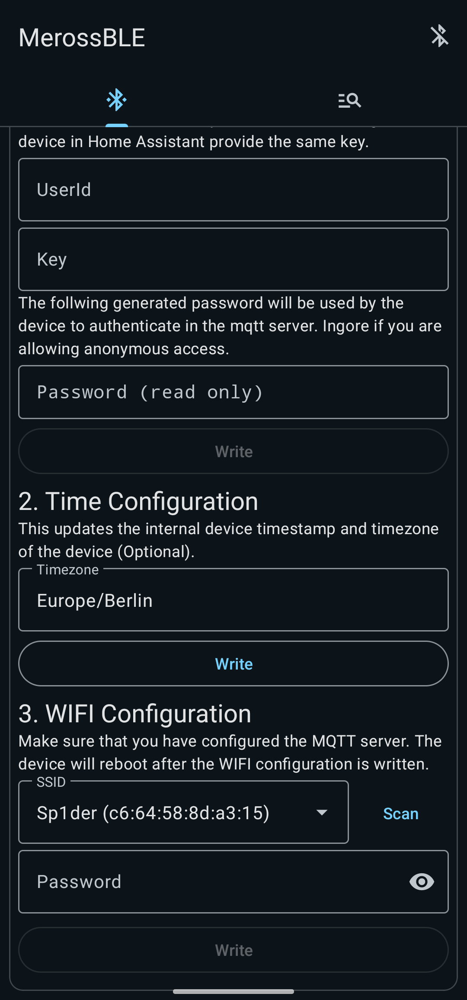
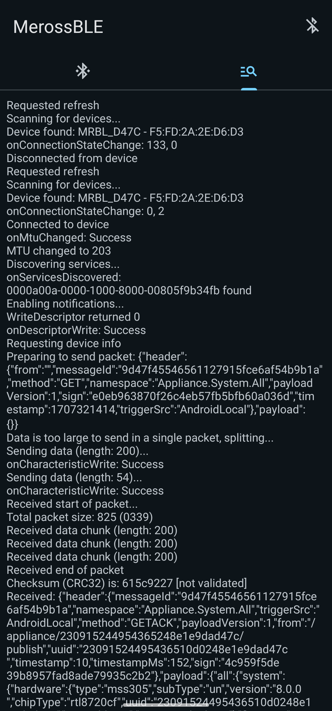

# MerossBLE

Simple Android app that allow you to configure newer Meross devices using Bluetooth Low Energy (BLE).
With this app you can manually set the devices MQTT server, UserId and Key. Also, you can
set the device's WiFi SSID and password.

## Supported devices

According to the source code from the official Meross app, the following devices should support
configuration over BLE:

- MSS110
- MSS305 (confirmed to work)
- MSS210
- MSS310
- MSS425FC
- MSS510X
- MSS620
- MSS630
- MSS710
- MSL120DA
- MSL210
- MRS100
- EM06

## Usage

1. Make sure that your device is in configuration mode (LED switching between red and green)
2. Open the app on your phone with bluetooth and all permissions enabled
3. Swipe from the top to perform a scan
4. Once a device is found it will automatically connect to it
5. You can now configure the device
6. After you wrote the WIFI section, the device will connect to the WIFI and disconnect from BLE

## Screenshots

## Protocol

Following information is based on reverse engineering the official Meross app and looking
at the bluetooth communication logs (HCI logs).
The communication happens over a GATT service with UUID `0000A00A-0000-1000-8000-00805F9B34FB`.
From this service the following characteristics are used:

- `0000B002-0000-1000-8000-00805F9B34FB`: Write-only characteristic to send commands to the device.
- `0000B003-0000-1000-8000-00805F9B34FB`: Notify characteristic to receive responses from the device.

Before the device sends any response, a custom descriptor of the notify characteristic must be written.
This is done by writing "0x01 0x00" to the descriptor with UUID `00002902-0000-1000-8000-00805f9b34fb`.

In order to send more data in a single packet, the MTU can be increased to 203 bytes. This allows
to send up to 200 bytes of data in a single packet. If a packet is larger it is split into multiple.

### Packet structure

The packet structure is as follows:

- First two bytes magic number: `55aa` (Used to identify the start of a packet)
- Next two bytes packet length: `XXXX` (Big endian; length of the data json)
- Data (raw ascii JSON data)
- Four bytes checksum: `XXXXXXXX` (standard CRC32 over the data)
- Last two bytes magic number: `aa55` (Used to identify the end of a packet)

### Messages

The messages itself are essentially the same as in the HTTP API. Once the device is connected to
the wifi, a configuration with other Meross tools is also possible.
